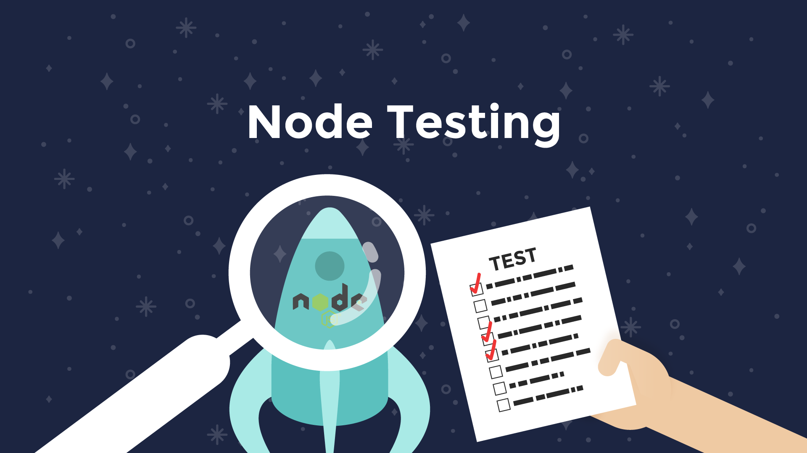
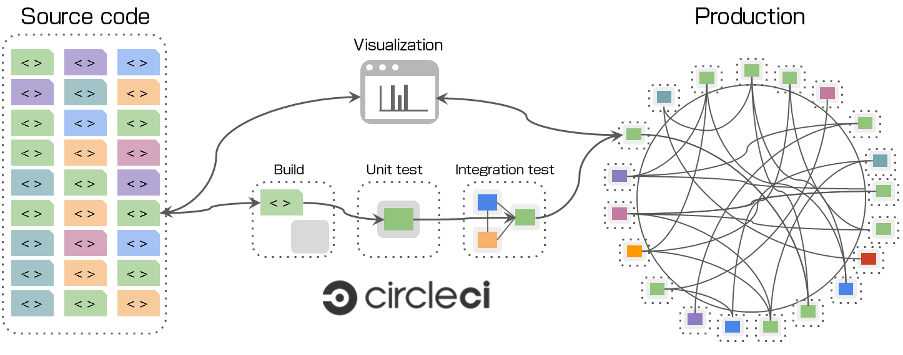

footer: © NodeProgram.com, Node.University and Azat Mardan 2018
slidenumbers: true
theme: Simple, 1
build-lists: true

[.slidenumbers: false] 
[.hide-footer]



---

# Node Testing
## How to Test Modules, APIs and UIs the Node Way


Azat Mardan @azat_co


---

# Table of Contents

---

## Module 1: Course Overview

* What to expect
* Why testing is important
* What you need

---

## Module 2: Unit testing

* Setting up testing framework: Mocha, Expect, Axios
* `describe()` and `it()`
* TDD assertion
* BDD style: Chai Expect

---

## Module 2: Unit testing (cont)

* `after()` and `before()`
* `afterEach()` and `beforeEach()`
* Writing unit tests

---

## Module 3: Functional/integration testing

* Testing CRUD REST API server (mocking)
* Testing CRUD REST API server (real)

---

## Module 4: UI and E2E Testing

* Testing UI with Selenium WebDriver
* Using CircleCI

---

## Outro

* Further Study
* Summary

---

## Slides & Source Code

<https://github.com/azat-co/node-testing>

---

# Node Testing
## Overview


Azat Mardan @azat_co


---

## Module 1: Course Overview

* What to expect
* Why testing is important
* What you need

---

## What to expect

* Unit testing
* API testing
* UI testing
* CI/CD
* Best tech stack
* No B.S. - Only necessary stuff

---

## Why testing is important

* Save time in the long-term
* Catch bugs -> better quality of software
* Automate deployment -> faster iteration -> better product
* Get confidence during refactor
* Document interface

---

## Testing Pyramid


---

## What you need

* Node v8+
* npm v5+
* Terminal
* Code editor
* [Selenium WebDriver server and Node client](http://www.seleniumhq.org/download)

---

# Node Testing
## Module 2: Unit Testing


Azat Mardan @azat_co


---

## Writing Unit tests

1. Testing Framework (Setup)
1. Import module from tests
1. Unit test for each method: provide input and compare output

---

## Testing Framework

* Mocha
* Chai Expect

---

## Testing Framework (cont)

Source code: `code/escape`

---

## Setting up Testing Framework

1. Create a new folder
2. Create package.json
3. Install dependencies
4. Write sample tests
5. Write sample code

---

## Escape Module

Converts special characters to HTML code

* `&` into `&amp;`
* `"` into `&quot;`
* `'` into `&#39;`
* `<` into `&lt;`
* `>` into `&gt;`

---

## Create from scratch

```
mkdir escape
cd escape
npm init -y
npm i mocha@3.5.0 chai@4.1.2 -E
mkdir test
```

---

## Run tests from `test` folder

```
mocha
npm test
```

package.json:

```
  "scripts": {
    "test": "mocha"
  },
```

---

## `describe()` and `it()`

Describe and it: noun and behavior

```js
const {expect} = require('chai'),
  {escape, unescape} = require('../index.js')()
describe('#escape', () => {
  it('converts & into &amp;', () => {
    expect(escape('&')).equal('&amp;')
  })
})
```

---

## Asynchronous `it()`

```js
const {expect} = require('chai'),
  {escape, unescape} = require('../index.js')()

describe('#escape', () => {
  it('converts & into &amp;', (done) => {
    setTimeout(()=>{
      expect(escape('&')).equal('&amp;')
      done()
    }, 1000)
  })
})
```

---

## Asynchronous `it()` (cont)

```js
describe('User', function() {
  describe('#save()', function() {
    it('should save without error', function(done) {
      var user = new User('Luna')
      user.save(function(err) {
        if (err) done(err)
        else done()
      })
    })
  })
})
```

---

## Asynchronous `it()` with Async/await

```js
describe('#find()', function() {
  it('responds with matching records', async function() {
    const users = await db.find({type: 'User'})
    users.should.have.length(3)
  })
})
```

---

## Asynchronous `it()` with async/await (cont)

```js
  it('posts an object', async () => {
    const {data: body} = await axios
      .post(`http://localhost:${port}/collections/test`, 
      { name: 'John', email: 'john@rpjs.co'})
    expect(body.length).to.eql(1)
    expect(body[0]._id.length).to.eql(24)
    id = body[0]._id
  })
```

---

## Asynchronous `it()` with Promise

```js
  it('posts an object', () => {
    return axios
      .post(`http://localhost:${port}/collections/test`,
       { name: 'John', email: 'john@rpjs.co'})
      .then(response=>response.data)
      .then((body) => {
        expect(body.length).to.eql(1)
        expect(body[0]._id.length).to.eql(24)
        id = body[0]._id
      })
  })
```

---

## `only()` and `skip()`

```js
  it.only(() => {})
```

```js
  it.skip(() => {})
```

---

## TDD Assertion

* Core module <https://nodejs.org/api/assert.html>
* Basic methods
* Throws errors

---

## Assert Example

```js
const assert = require('assert')
assert.equal(1, 1) // OK, 1 == 1
assert.equal(1, '1') // OK, 1 == '1'
```

---


```js
const assert = require('assert')

describe('#escape', () => {
  it('converts & into &amp;', () => {    
    assert.equal(escape('&'), '&amp;')
  })
})
```

---

## BDD style: Chai Expect

* Chai npm library <http://chaijs.com/api/bdd>
* A lot of methods
* Language Chains (readability)

---

## Chai Expect

```js
expect(function () {}).to.not.throw()
expect({a: 1}).to.not.have.property('b')
expect([1, 2]).to.be.an('array').that.does.not.include(3)
expect(2).to.equal(2)
expect({a: 1}).to.deep.equal({a: 1})
expect({a: 1}).to.not.equal({a: 1})
```

---

## `after()` and `before()`

```js
describe('#escape', () => {

  before(() => {
    // runs before all tests in this block
  })

  after(() => {
    // runs after all tests in this block
  })

  // test cases
  it()
  it()
  it()
})
```

---

## `afterEach()` and `beforeEach()`

```js
describe('#escape', () => {

  beforeEach(() => {
    // runs before each test in this block
  })

  afterEach(() => {
    // runs after each test in this block
  })

  // test cases
  it()
  it()
  it()  
})
```

---

## Async `before()` and `after()`

```js
before((done) => {
  app.listen(port, ()=>{
    console.log('server is running')
    done()
  })
})
```

```js
before(async function() {
  await app.listen(port, ()=>{console.log('server is running')})
  console.log('code after the server is running')
})
```

```js
before(()=>{
  return new Promise((resolve, reject) => {
    return app.listen(port, resolve)
  }).then(()=>{
    console.log('server is running')
  })
})
```

---

## Demo escape Module Unite Testing

```
cd code/escape
npm i
npm test
```

---

# Node Testing
## Module 3: Functional/integration testing


Azat Mardan @azat_co


---

## Module 3: Functional/integration testing

---

## Testing CRUD REST API server (mocking)

* Supertest
* Chai Expect
* Mocha

---

## Testing CRUD REST API server (mocking)

Source code: `code/mock-rest-test`

---

## Supertest in Action

```js
const app = require('../server.js')
describe('express rest api server', () => {
  let id

  it('posts an object', (done) => {
    supertest(app).post(`/collections/test`)
      .send({ name: 'John'
        , email: 'john@rpjs.co'
      })
      .expect(200)
  })
})      
```

---

## Demo Testing CRUD REST API server (mocking)

---

## Testing CRUD REST API server (real)

* Axios
* Mocha
* Chai Expect

---

## Testing CRUD REST API server (real)

Source code: `code/rest-test`

---

## Three CRUD test versions

* Callbacks
* Promises
* Async/await

---

## Demo Testing CRUD REST API server (real)

---

# Node Testing
## Module 4: UI and E2E Testing


Azat Mardan @azat_co


---

## Testing UI with Selenium WebDriver

* Selenium WebDriver Server
* Selenium Node Client
* Mocha
* Chai Expect

---


## Testing UI with Selenium WebDriver

`code/e2e-test`

---

## e2e-test structure

```
/e2e-test
  /chromedriver32
  /node_modules
  /test
  google.test.js
  package-lock.json
  package.json
```

---

```
  "scripts": {
    "test": "PATH=\"./chromedriver2.32/:$PATH\" mocha  --no-timeouts"
  },
```

---

```js
var webdriver = require('selenium-webdriver'),
  By = webdriver.By,
  until = webdriver.until

var driver = new webdriver.Builder()
  .forBrowser('chrome')
  .build()

driver.get('http://www.google.com/ncr')
driver.findElement(By.name('q')).sendKeys('webdriver')
driver.findElement(By.name('q')).sendKeys(webdriver.Key.ENTER)
driver.wait(until.titleIs('webdriver - Google Search'), 1000)
driver.sleep(20000)
driver.quit()
```

---

## Demo Testing UI with Selenium WebDriver

---

# Node Testing
## CI/CD


Azat Mardan @azat_co


---

## CI/CD Using CircleCI

---



---

Creating yml config:

```
/ci-test
  /test
  server.js
  package.json
  circle.yml
```

---

## CircleCI: Configuring Node 

```yml
machine:
  node:
    version: 8.2.0
```

---

## CircleCI Node Versions

CircleCI uses NVM to manage Node versions. Pre-installed versions can be found on [the Ubuntu 14.04 (default)](https://circleci.com/docs/1.0/build-image-trusty/#nodejs) and [Ubuntu 12.04 pages](https://circleci.com/docs/1.0/build-image-precise/#nodejs) respectively.

---

## CircleCI: Running Tests

* Runs `npm test` when you specify a `test` script in package.json. 
* Runs Mocha tests 
* Runs any test targets in Cakefiles or Makefiles

---

## CircleCI: Running Tests (cont)

Runs `npm i` automatically if there's `package.json`. To override:

```yml
dependencies:
  override:
    - npm install --dev
```

```yml
dependencies:
  override:
    - npm install --production
```

---

## CircleCI: Test *post* Command

```yml
test:
  post:
    - ./test.sh
```

---

## CircleCI: Database 

```yml
database:
  # Circle will execute the below commands
  pre:
    # Stop MongoDB
    - sudo service mongodb stop
    # Download MongoDB 3.2.3
    - curl -Ol https://fastdl.mongodb.org/linux/mongodb-linux-x86_64-ubuntu1204-3.2.3.tgz
    # Untar it
    - tar -zxvf mongodb-linux-x86_64-ubuntu1204-3.2.3.tgz
    # Create data directory
    - mkdir -p ./data/db
    # Fork MongoDB and log to './mongod.log'. Print the log file if it failed.
    - ./mongodb-linux-x86_64-ubuntu1204-3.2.3/bin/mongod --dbpath ./data/db --logpath ./mongod.log --fork || cat ./mongod.log
```

---

# Node Testing
## Outro


Azat Mardan @azat_co


---

## Useful Tools

* Sinon
* Jest
* Jenkins
* loadtest, artillery and jMeter

---

## Useful Services

* Team City, TravisCI
* AWS CodeDeploy, CodePipeline, CodeBuild
* SauceLabs

---

## Further Study

* For CI/CD with Amazon Web Services CodePipeline, CodeDeploy and CodeBuild: [AWS Intermediate](https://node.university/p/aws-intermediate)
* For containers: [Node in Production](https://node.university/p/node-in-production)
* For React, and Jest testing: React Quickly [GitHub](https://github.com/azat-co/react-quickly) and [book](https://www.manning.com/books/react-quickly?a_aid=a&a_bid=5064a2d3)

---

## Summary

* Testing saves time in the long-term
* Cloud, virtualization and containers make testing easier and more dependable
* Stick to the testing pyramind: more unit tests and fewer E2E tests