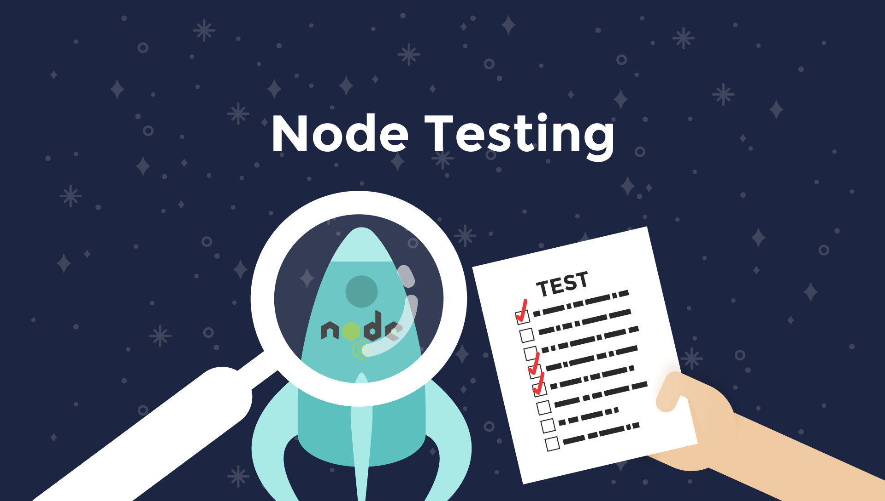

footer: © NodeProgram.com, Node.University and Azat Mardan 2017
slidenumbers: true
theme: Simple, 1
build-lists: true

[.slidenumbers: false] 
[.hide-footer]



---

# Node Testing
## How to Test Modules, APIs and UIs the Node Way


Azat Mardan @azat_co


---

# Table of Contents

---

## Module 1: Course Overview

* What to expect
* Why testing is important
* What you need

---

## Module 2: Unit testing

* Setting up testing framework: Mocha, Expect, Axios
* Describe, `it`
* TDD assertion
* BDD style: Chai expect

---

## Module 2: Unit testing (cont)

* after and before
* each and afterEach, beforeEach
* Writing unit tests
* (TDD+ BDD): Mocha, Expect, Jest, Superagent, Unit and Functional/Integration Testing

Create Node Testing with Mocha for unit testing, then for REST API and for UI testing (e2e)

---

## Module 3: Functional/integration testing

* Testing CRUD REST API server (Mocking)
* Testing CRUD REST API server (real)
* Testing GraphQL server

---

## Module 4: UI and E2E Testing

* Testing UI with Selenium WebDriver

---

## CI/CD

* Using CircleCI: creating yml config
* Using AWS and Jenkins

## Outro

* Summary

---

# Node Testing
## Overview


Azat Mardan @azat_co


---


## Module 1: Course Overview

* What to expect
* Why testing is important
* What you need

---

## What to expect

* Unit testing
* API testing
* UI testing
* CI/CD
* Best tech stack
* No B.S. - Only necessary stuff

---

## Why testing is important

* Save time in the long-term
* Catch bugs -> better quality of software
* Automate deployment -> faster iteration -> better product
* Get confidence during refactor
* Document interface

---

## Testing Pyramid


---

## What you need

* Node v8+
* npm v5+
* Terminal
* Code editor
* [Selenium WebDriver server and Node client](http://www.seleniumhq.org/download/)

---

# Node Testing
## Module 2: Unit Testing


Azat Mardan @azat_co


---

## Writing Unit tests

1. Testing Framework (Setup)
1. Import module from tests
1. Unit test for each method: provide input and compare output

---


## Testing Framework

* Mocha
* Chai Expect

---

## Setting up Testing Framework

1. Create a new folder
2. Create package.json
3. Install dependencies
4. Write sample tests
5. Write sample code

---

## Escape Module

Converts special characters to HTML code

* `&` into `&amp;`
* `"` into `&quot;`
* `'` into `&#39;`
* `<` into `&lt;`
* `>` into `&gt;`

---


```
mkdir escape
cd escape
npm init -y
npm i mocha@3.5.0 chai@4.1.2 -E
mkdir test
```

---

Run tests from `test` folder:

```
mocha
npm test
```

package.json:

```
  "scripts": {
    "test": "mocha"
  },
```

---


## Describe and it

Describe and it: noun and behavior

```js
const {expect} = require('chai'),
    {escape, unescape} = require('../index.js')()
describe('#escape', () => {
  it('converts & into &amp;', () => {
    expect(escape('&')).equal('&amp;')
  })
})
```

---

## Asynchronous it

```js
const {expect} = require('chai'),
    {escape, unescape} = require('../index.js')()

describe('#escape', () => {
  it('converts & into &amp;', (done) => {
    setTimeout(()=>{
      expect(escape('&')).equal('&amp;')
      done()
    }, 1000)
  })
})
```

---

```js
describe('User', function() {
  describe('#save()', function() {
    it('should save without error', function(done) {
      var user = new User('Luna')
      user.save(function(err) {
        if (err) done(err)
        else done()
      })
    })
  })
})
```

---

## Async/await it

```js
describe('#find()', function() {
  it('responds with matching records', async function() {
    const users = await db.find({type: 'User'})
    users.should.have.length(3)
  })
})
```

---

## TDD Assertion

* Core module <https://nodejs.org/api/assert.html>
* Basic methods
* Throws errors

---

## Assert Example

```js
const assert = require('assert')
assert.equal(1, 1) // OK, 1 == 1
assert.equal(1, '1') // OK, 1 == '1'
```

---


```js
const assert = require('assert')

describe('#escape', () => {
  it('converts & into &amp;', () => {    
    assert.equal(escape('&'), '&amp;')
  })
})
```

---

## BDD style: Chai Expect

* Chai npm library <http://chaijs.com/api/bdd>
* A lot of methods
* Language Chains (readability)

---

## Chai Expect

```js
expect(function () {}).to.not.throw()
expect({a: 1}).to.not.have.property('b')
expect([1, 2]).to.be.an('array').that.does.not.include(3)
expect(2).to.equal(2)
expect({a: 1}).to.deep.equal({a: 1})
expect({a: 1}).to.not.equal({a: 1})
```

---

## after and before

```js
describe('#escape', () => {

  before(() => {
    // runs before all tests in this block
  })

  after(() => {
    // runs after all tests in this block
  })

  // test cases
  it()
  it()
  it()
})
```

---

## afterEach and beforeEach

```js
describe('#escape', () => {
  beforeEach(() => {
    // runs before each test in this block
  })

  afterEach(() => {
    // runs after each test in this block
  })

  // test cases
  it()
  it()
  it()  
})
```

---

## Demo escape Module Unite Testing

---

# Node Testing
## Module 3: Functional/integration testing


Azat Mardan @azat_co


---

## Module 3: Functional/integration testing

* Testing CRUD REST API server (Mocking)
* Testing CRUD REST API server (real)
* Testing GraphQL server


## (TDD+ BDD): Mocha, Expect, Jest, Superagent, Unit and Functional/Integration Testing


Create Node Testing with Mocha for unit testing, then for REST API and for UI testing (e2e)

---

# Node Testing
## Module 4: UI and E2E Testing


Azat Mardan @azat_co


---

* Testing UI with Selenium WebDriver

---

# Node Testing
## CI/CD


Azat Mardan @azat_co


---

* Using CircleCI: creating yml config
* Using AWS and Jenkins

---

# Node Testing
## Outro


Azat Mardan @azat_co


---

## Summary